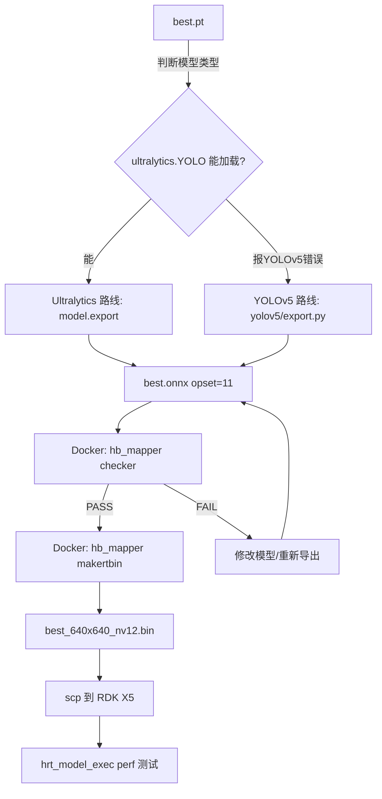

# YOLO 模型转 RDK X5 .bin 完整指南（实战版）

<div align="center">

| | |
|---|---|
| **文档版本** | v2.0 |
| **最后更新** | 2026-05-28 |
| **适用硬件** | RDK X5 开发板（旭日5 / Sunrise5） |
| **核心工具** | 地平线 X5 OpenExplorer 工具链 |
| **已验证镜像** | `ai_toolchain_ubuntu_20_x5_cpu:v1.2.8` |

</div>

---

## 📋 文档信息

| 项目 | 内容 |
|------|------|
| **作者** | 宋楠 |
| **职位** | 嵌入式工程师 |
| **公众号** | 周哈飞科技园 |
| **B站** | 科大楠哥 |
| **电话** | 15840252139 |
| **版权** | © 2026 宋楠。版权所有，未经许可不得复制、转载或用于商业用途。侵权必究。 |

---

## ⚠️ 重要：你属于哪条路线？

| 你的模型 | 走哪条路 | 标志 |
|----------|----------|------|
| **YOLOv5** 训练的 `.pt` | → [第一篇：YOLOv5 路线](#第一篇yolov5-路线) | 报错 `YOLOv5 model NOT compatible with YOLOv8` |
| **YOLOv8/v10/v11/v12/v13** 训练的 `.pt` | → [第二篇：Ultralytics 路线](#第二篇ultralytics-路线yolov8v10v11v12v13) | 能正常 `from ultralytics import YOLO` 加载 |

> **判断方法**：在 Ubuntu 里跑一下：
> ```bash
> python3 -c "from ultralytics import YOLO; YOLO('best.pt')"
> ```
> 报 `YOLOv5 model NOT compatible` → 走第一篇；成功加载 → 走第二篇。

---

# 第一篇：YOLOv5 路线

## 坑点速览（先看再操作）

| 坑 | 症状 | 解法 |
|----|------|------|
| 🔴 `YOLO(PT)` 报 YOLOv5 不兼容 | `TypeError: best.pt appears to be an Ultralytics YOLOv5 model` | 必须用 yolov5 官方 export.py，不能用 ultralytics 包 |
| 🔴 opset 是 18 不是 11 | checker 报 `maximum supported version is 11` | 装 `torch==1.13.1+cpu`，低版本 PyTorch 才会导出 opset=11 |
| 🔴 IR version 10 > 9 | checker 报 `ir version greater than 9` | 容器内 `m.ir_version=7; onnx.save()` |
| 🔴 GitHub git clone 超时 | `GnuTLS recv error` | 先配 git 代理 `git config --global http.proxy http://192.168.192.1:7890` |

---

### 1. 环境准备（YOLOv5）

```bash
# Docker 安装
sudo apt install docker.io -y
sudo groupadd docker && sudo gpasswd -a ${USER} docker && sudo service docker restart
# 退出终端重登

# 配 Docker 代理（VMware NAT 共享 Windows 梯子）
sudo mkdir -p /etc/systemd/system/docker.service.d
sudo tee /etc/systemd/system/docker.service.d/http-proxy.conf << 'EOF'
[Service]
Environment="HTTP_PROXY=http://192.168.192.1:7890"
Environment="HTTPS_PROXY=http://192.168.192.1:7890"
EOF
sudo systemctl daemon-reload && sudo systemctl restart docker

# 清镜像源（防干扰）
sudo rm -f /etc/docker/daemon.json && sudo systemctl restart docker

# 拉工具链（注意不是 latest，必须指定版本号！）
docker pull openexplorer/ai_toolchain_ubuntu_20_x5_cpu:v1.2.8
```

---

### 2. PT → ONNX（YOLOv5 专用）

> ⚠️ **关键**：不能用 `ultralytics` 包加载 YOLOv5 模型！必须用 yolov5 仓库原生工具。


```bash
# 工作目录
mkdir -p /home/hafeizhou/Desktop/x5_work
cd /home/hafeizhou/Desktop/x5_work

# 配 git 代理（7890 换成你实际端口）
git config --global http.proxy http://192.168.192.1:7890
git config --global https.proxy http://192.168.192.1:7890

# 克隆 yolov5 仓库
git clone https://github.com/ultralytics/yolov5.git
cd yolov5

# ⚠️ 坑：必须用低版本 PyTorch，高版本导出的 opset 是 18，X5 只支持到 11！
pip install torch==1.13.1+cpu torchvision==0.14.1+cpu \
  -f https://download.pytorch.org/whl/cpu/torch_stable.html

# 装其他依赖（含 numpy<2 因为新版与低版 onnx 冲突）
pip install "numpy<2" "onnx<1.14.0" "onnxruntime<=1.16" \
  -i https://pypi.tuna.tsinghua.edu.cn/simple --trusted-host pypi.tuna.tsinghua.edu.cn

# 装 yolov5 基础依赖
pip install pandas requests pyyaml tqdm \
  -i https://pypi.tuna.tsinghua.edu.cn/simple --trusted-host pypi.tuna.tsinghua.edu.cn

# yolov5 最新版依赖 ultralytics 的 torch_load，需要装 ultralytics（但不装它的依赖）
pip install ultralytics --no-deps \
  -i https://pypi.tuna.tsinghua.edu.cn/simple --trusted-host pypi.tuna.tsinghua.edu.cn

# 把 best.pt 拷进来并导出 ONNX
cp ../best.pt .
python3 export.py --weights best.pt --include onnx --opset 11 --imgsz 640 640 --batch-size 1

# 验证 opset 是否确实是 11
python3 -c "import onnx; m=onnx.load('best.onnx'); print([(o.domain,o.version) for o in m.opset_import])"
# 预期输出：[('ai.onnx', 11)]

# 拷回工作目录
cp best.onnx /home/hafeizhou/Desktop/x5_work/
```

---

### 3. 剩余步骤（与第二篇共用）

> 从 **[第三篇：通用转换流程](#第三篇通用转换流程checker--makertbin)** 继续。

---

# 第二篇：Ultralytics 路线（YOLOv8/v10/v11/v12/v13）

## 坑点速览

| 坑 | 症状 | 解法 |
|----|------|------|
| 🔴 pip install 超时 | `Read timed out` | 加 `-i https://pypi.tuna.tsinghua.edu.cn/simple` |
| 🔴 磁盘空间不足 | `No space left on device` | `pip cache purge` 清理 |
| 🔴 默认装 GPU 版 torch（巨大） | 下载 2GB+ | 手动装 CPU 版 |
| 🔴 opset 太高 | checker 报不通过 | 导出时指定 `opset=11` |
| 🔴 IR version 太高 | checker 报 `ir version greater than 9` | 容器内降 IR 到 7 |

---

### 1. 环境准备（Ultralytics）

Docker 部分与第一篇相同（工具链镜像），略。

### 2. PT → ONNX（Ultralytics 专用）

```bash
cd /home/hafeizhou/Desktop/x5_work

# 先装 CPU 版 PyTorch（省流量，约 200MB）
pip install torch torchvision \
  --index-url https://download.pytorch.org/whl/cpu \
  -i https://pypi.tuna.tsinghua.edu.cn/simple --trusted-host pypi.tuna.tsinghua.edu.cn

# 再装 ultralytics（约 1.3MB，不加 --no-deps 会自动拉 PyTorch，所以先装好 torch）
pip install ultralytics \
  -i https://pypi.tuna.tsinghua.edu.cn/simple --trusted-host pypi.tuna.tsinghua.edu.cn

# 导出 ONNX
python3 -c "
from ultralytics import YOLO
model = YOLO('best.pt')
model.export(format='onnx', imgsz=640, opset=11, simplify=True, batch=1)
print('Done! best.onnx created.')
"

# 验证 opset
python3 -c "import onnx; m=onnx.load('best.onnx'); print([(o.domain,o.version) for o in m.opset_import])"
```

---

### 3. 剩余步骤

> 从 **[第三篇：通用转换流程](#第三篇通用转换流程checker--makertbin)** 继续。

---

# 第三篇：通用转换流程（Checker → makertbin）

> YOLOv5 和 Ultralytics 路线在这一步汇合，操作完全一样。

---

### 1. 启动 Docker 容器

```bash
docker run -it --rm \
  -v /home/hafeizhou/Desktop/x5_work:/workspace \
  openexplorer/ai_toolchain_ubuntu_20_x5_cpu:v1.2.8
```

> 退出容器：`Ctrl+D` 或 `exit`

---

### 2. 降 IR 版本 + 模型验证

```bash
cd /workspace

# ⚠️ 坑：IR version 必须是 7~9，>=10 会报错
python3 -c "import onnx; m=onnx.load('best.onnx'); m.ir_version=7; onnx.save(m,'best.onnx'); print('IR=7 ok')"

# 验证模型兼容性
hb_mapper checker --model-type onnx --model best.onnx --march bayes-e
```

| 参数 | 含义 |
|------|------|
| `--model-type onnx` | 模型格式 |
| `--model best.onnx` | 模型文件 |
| `--march bayes-e` | X5 芯片代号（**必须填 bayes-e**） |

**预期结果**：所有算子标 `BPU`，最后显示 `End model checking....`，无 ERROR。

> ❌ 常见报错：
> - `maximum supported opset is 11` → 导出时没指定 `opset=11`，回到 PT→ONNX 步骤重来
> - `IR version greater than 9` → 没降 IR，先执行 `m.ir_version=7` 那一步

---

### 3. YAML 配置

> ⚠️ **坑点汇总**：
> - `march` 要放 `model_parameters` 下，不能放 `compiler_parameters` 下
> - `input_shape` 用 `x` 分隔，**不能**用逗号：`1x3x640x640` ✅ `1,3,640,640` ❌
> - 不需要 `compiler_parameters` 段（这个版本的 OE 工具链不认）
> - `calibration_type: "skip"` 跳过校准（先快速出 .bin 测性能）

```bash
cat > /workspace/yolo_config.yaml << 'EOF'
model_parameters:
  onnx_model: "best.onnx"
  march: "bayes-e"

input_parameters:
  input_type_rt: "nv12"
  input_type_train: "rgb"
  input_layout_train: "NCHW"
  norm_type: "data_scale"
  scale_value: 0.0039216
  input_shape: "1x3x640x640"

calibration_parameters:
  cal_data_dir: "./calibration_data"
  calibration_type: "skip"
EOF
```

| 参数 | 含义 | 填哪个 |
|------|------|--------|
| `input_type_rt` | 板端输入格式 | `nv12`（硬件加速最优） |
| `input_type_train` | 训练时格式 | `rgb`（YOLO 默认就是 rgb） |
| `input_layout_train` | 训练时 layout | `NCHW` |
| `norm_type` | 归一化方式 | `data_scale` = `data × scale_value` |
| `scale_value` | 归一化系数 | `0.0039216` = 1/255 |
| `calibration_type` | 校准方式 | `skip`（快速出 bin）/ `default`（正式） |

---

### 4. 校准数据准备

#### 4.0 先搞懂：什么时候需要校准？

`calibration_type` 有两个值，不同阶段用不同的：

| 值 | 含义 | 精度 | 速度 | 适用场景 |
|----|------|:---:|:---:|---------|
| `"skip"` | 跳过校准，用默认参数直接量化 | ⭐⭐ | 快 | 第 1 次跑，验证转换流程能不能通 |
| `"default"` | 用校准数据指导量化 | ⭐⭐⭐ | 慢（多几分钟） | 正式部署，追求板端精度 |

**推荐路线**：先 `"skip"` 快速出一版 `.bin` 跑通流程 → 再 `"default"` 出正式版。

> 如果你现在 yaml 里写的是 `calibration_type: "skip"`，且你只是想先验证转换能不能通，**直接跳到第 5 步**，本节不用看。

---

#### 4.1 准备校准图片（宿主机操作）

校准需要 **100 张左右**能代表你实际场景的图片。图片要求：

- 格式：`.jpg` / `.jpeg` / `.png` / `.bmp`
- 尺寸：不限（脚本会自动 resize 到 640×640）
- 数量：建议 100~200 张，最少 50 张
- 来源：从训练集/测试集里随机挑，或者用实际场景拍的照片

**⚠️ 在宿主机执行**，把图片放到这个目录：

```bash
mkdir -p /home/hafeizhou/Desktop/x5_work/calibration_images
# 然后用文件管理器拖进去，或者 cp 进来
# 比如：cp /path/to/your/images/*.jpg /home/hafeizhou/Desktop/x5_work/calibration_images/
```

确认图片数量：

```bash
ls /home/hafeizhou/Desktop/x5_work/calibration_images/ | wc -l
```

> 注意：如果你是**第 2 次跑校准**（之前跑过一次 skip 或之前校准过），先清掉旧的：
> ```bash
> rm -rf /home/hafeizhou/Desktop/x5_work/calibration_data/
> ```

---

#### 4.2 启动容器并预处理图片

**进入容器**：

```bash
docker run -it --rm \
  -v /home/hafeizhou/Desktop/x5_work:/workspace \
  openexplorer/ai_toolchain_ubuntu_20_x5_cpu:v1.2.8
```

**在容器内**执行以下命令（全部复制，一次粘贴进去）：

```bash
# 1. 创建校准数据输出目录
mkdir -p /workspace/calibration_data

# 2. 写预处理脚本（把 jpg/png 转成工具链要求的 .bin 格式）
cat > /workspace/preprocess.py << 'PYEOF'
import os, cv2
import numpy as np

src_dir = "/workspace/calibration_images"
dst_dir = "/workspace/calibration_data"
os.makedirs(dst_dir, exist_ok=True)

count = 0
for fname in sorted(os.listdir(src_dir)):
    if not fname.lower().endswith(('.jpg','.jpeg','.png','.bmp')):
        continue
    img = cv2.imread(os.path.join(src_dir, fname))
    if img is None:
        print(f"  [跳过] 无法读取: {fname}")
        continue
    # resize 到 640x640（和模型输入一致）
    img = cv2.resize(img, (640, 640))
    # BGR → RGB（训练时用的是 RGB）
    img = cv2.cvtColor(img, cv2.COLOR_BGR2RGB)
    # 转 float32（不做归一化，工具链内部会处理）
    img = img.astype(np.float32)
    # 保存为 .bin（地平线工具链要求 raw binary 格式）
    img.tofile(os.path.join(dst_dir, fname.rsplit('.', 1)[0] + '.bin'))
    count += 1
    print(f"[{count}] Processed: {fname}")

print(f"\nDone! {count} files saved to {dst_dir}")
PYEOF

# 3. 运行预处理脚本
python3 preprocess.py
```

**预期输出**：

```
[1] Processed: img001.jpg
[2] Processed: img002.jpg
...
[100] Processed: img100.jpg

Done! 100 files saved to /workspace/calibration_data
```

确认生成的文件：

```bash
ls /workspace/calibration_data/ | wc -l   # 应该等于你的图片数量
ls /workspace/calibration_data/ | head -5  # 看前 5 个文件名
```

---

#### 4.3 改 YAML 配置

把 yaml 里的 `calibration_type` 从 `"skip"` 改成 `"default"`。

用 `sed` 一键改（在容器内执行）：

```bash
sed -i 's/calibration_type: "skip"/calibration_type: "default"/' /workspace/yolo_config.yaml
```

或者手动编辑：

```bash
vi /workspace/yolo_config.yaml
# 找到 calibration_type: "skip" → 改成 calibration_type: "default"
# :wq 保存退出
```

确认改对了：

```bash
grep calibration_type /workspace/yolo_config.yaml
# 应该输出：  calibration_type: "default"
```

---

#### 4.4 重新转换（这一次带校准）

```bash
cd /workspace
hb_mapper makertbin --config yolo_config.yaml --model-type onnx
```

命令和之前一样，但这次它会读 `calibration_data/` 里的数据来优化量化参数，运行时间比 `skip` 模式长几分钟（100 张图大约多 2~5 分钟）。

**完成后**，`.bin` 在 `model_output/` 下，直接跳到第 5.5 节去验证。

---

#### 4.5 快捷命令汇总（不想理解原理的看这里）

| 步骤 | 在哪执行 | 命令 |
|------|---------|------|
| 放图片 | 宿主机 | 把 100 张 jpg 拖进 `~/Desktop/x5_work/calibration_images/` |
| 进容器 | 宿主机 | `docker run -it --rm -v ~/Desktop/x5_work:/workspace openexplorer/ai_toolchain_ubuntu_20_x5_cpu:v1.2.8` |
| 预处理 | 容器内 | `mkdir -p /workspace/calibration_data && python3 preprocess.py`（先 cat 写脚本） |
| 改 yaml | 容器内 | `sed -i 's/"skip"/"default"/' /workspace/yolo_config.yaml` |
| 重新转换 | 容器内 | `hb_mapper makertbin --config yolo_config.yaml --model-type onnx` |
| 验证 | 容器内 | `cd model_output && hb_verifier -m model_quantized_model.onnx,model.bin -s True` |

---

### 5. ONNX → .bin 转换（临门一脚）

```bash
cd /workspace
hb_mapper makertbin --config yolo_config.yaml --model-type onnx
```

成功后会在 `model_output/` 生成：

```bash
ls model_output/*.bin
# 预期：model_output/model.bin
```

---

### 5.5 无板验证：确认 .bin 模型正确性

> 如果你手头没有 RDK X5 板子，可以在容器内验证 .bin 和量化 ONNX 的数值一致性。

#### 5.5.1 hb_verifier 严格一致性检查

```bash
cd /workspace/model_output
hb_verifier -m model_quantized_model.onnx,model.bin -s True
```

| 参数 | 含义 |
|------|------|
| `-m` | 模型文件，逗号分隔（量化 ONNX + .bin） |
| `-s True` | 用 X86 仿真模式跑 .bin（不需要板子） |

**预期输出**：
```
Strict check PASSED
Quanti.onnx and Sim result Strict check PASSED
```

> ✅ PASSED = .bin 和量化 ONNX 输出数值完全一致，转换无误。
>
> ❌ 如果 FAILED，检查 `hb_verifier.log` 看输出差异。

#### 5.5.2 量化 ONNX 推理测试（单张图片）

`.bin` 和 `model_quantized_model.onnx` 输出一致，可用 ONNX 做推理验证：

```bash
cd /workspace

python3 -c "
from horizon_tc_ui import HB_ONNXRuntime
import numpy as np, cv2

sess = HB_ONNXRuntime(model_file='model_output/model_quantized_model.onnx')
sess.set_dim_param(0, 0, '?')

# 读取并预处理图片
img = cv2.imread('test.jpg')  # 换成你的测试图片
img = cv2.resize(img, (640, 640))
img = cv2.cvtColor(img, cv2.COLOR_BGR2RGB)
img = img.astype(np.float32) * 0.0039216  # 归一化 1/255
img = np.transpose(img, (2, 0, 1))[np.newaxis, ...]  # HWC → NCHW

# 推理
outputs = sess.run(sess.output_names, {sess.input_names[0]: img})
print('Output shape:', outputs[0].shape)
print('First detection:', outputs[0][0, 0, :])  # 第一行结果
"
```

> 输出 shape 应为 `[1, 25200, 6]`（YOLOv5/7/9）或 `[1, N, 85]`（YOLOv8/11）。
>
> 每行 6 个值（v5）= `[x, y, w, h, confidence, class_id]`。confidence > 0.5 即检测到目标。

#### 5.5.3 静态性能报告

转换时自动生成了 `model_output/*.html`，浏览器打开查看：

```bash
# 拷到宿主机
cp /workspace/model_output/*.html /home/hafeizhou/Desktop/x5_work/
```

在 Ubuntu 宿主机用 Firefox 打开 `.html` 文件，可以看到：
- **Summary**：预估 FPS、延迟、DDR 带宽
- **Layer Details**：每层 BPU 算子耗时分布
- **Temporal Statistics**：一帧内带宽占用曲线

---

### 6. 部署到 RDK X5 板子

```bash
# 退出容器
exit

# 拷到板子
scp /home/hafeizhou/Desktop/x5_work/best_640x640_nv12.bin root@板子IP:/userdata/
```

---

### 7. 板端测试

```bash
ssh root@板子IP

# 测单线程延迟
hrt_model_exec perf --model_file /userdata/best_640x640_nv12.bin --thread_num 1 --frame_count 200

# 测多线程并发帧率
hrt_model_exec perf --model_file /userdata/best_640x640_nv12.bin --core_id 0 --thread_num 8 --frame_count 1000
```

> 如果报 `hrt_model_exec: command not found`，在开发机 OE 包里跑：
> ```bash
> cd /open_explorer/package/board && bash install.sh 板子IP
> ```

---

## 🧹 换模型 / 清理旧文件（一键干净重来）

> 🔴🔴🔴 **血泪警告：以下所有 rm 命令必须在 Ubuntu 宿主机执行，绝对不能在 Docker 容器内执行！！！**
> 
> Docker 启动时 `-v ~/Desktop/x5_work:/workspace` 挂载了目录，容器内的 `/workspace` **就是**宿主机的 `x5_work`。
> 在容器内执行 `rm -rf /workspace/*` = 删除宿主机上的所有模型文件，**不可逆**。
> 
> **判断你在哪里**：看终端提示符——
> - `hafeizhou@hafeizhou-virtual-machine:~$` → ✅ 宿主机，安全
> - `root@f88672e3a538:/workspace#` → ❌ Docker 容器内，**立刻停手，先 exit 退出！**

当你训练了新模型、换了 `best.pt`，需要把旧模型的残留文件清掉再重新转换。

### 哪些文件需要清理？

| 位置 | 文件/目录 | 说明 |
|------|-----------|------|
| 宿主机 `~/Desktop/x5_work/` | `best.pt`、`best.onnx` | 旧模型权重和 ONNX |
| 宿主机 `~/Desktop/x5_work/` | `yolo_config.yaml` | 旧转换配置 |
| 宿主机 `~/Desktop/x5_work/` | `model_output/` | 旧 .bin 产出 |
| 宿主机 `~/Desktop/x5_work/` | `calibration_data/`、`calibration_images/` | 旧校准数据 |
| 宿主机 `~/Desktop/x5_work/` | `yolov5/` | 旧 yolov5 仓库（含中间文件） |
| 宿主机 `~/Desktop/x5_work/` | `*.html` | 旧性能报告 |
| Docker 容器 | 容器实例 | 退出即清（`--rm` 参数） |

### 一键清理脚本

> ⚠️ **再次确认**：看到 `hafeizhou@` 开头的提示符才能执行！如果是 `root@` 开头，先 `exit` 退出容器！

```bash
# 在宿主机执行！！！不要进容器！！！
cd ~/Desktop/x5_work

# === 清旧模型文件 ===
rm -f best.pt best.onnx

# === 清转换产出 ===
rm -rf model_output/

# === 清校准数据 ===
rm -rf calibration_data/ calibration_images/

# === 清中间配置文件 ===
rm -f yolo_config.yaml preprocess.py
rm -f *.html

# === 清 yolov5 仓库（下次会自动 git clone 新的）===
rm -rf yolov5/

# === 确认清理结果 ===
echo "=== 清理完毕，当前目录内容 ==="
ls -la
```

### 清理后重新转换的步骤

```bash
# 1. 把新 best.pt 放进工作目录
cp /path/to/new_best.pt ~/Desktop/x5_work/best.pt

# 2. 重新跑 PT → ONNX（按你的路线选择）
#    YOLOv5：按「第一篇」步骤 2
#    Ultralytics：按「第二篇」步骤 2

# 3. 重新跑 Checker → makertbin（按「第三篇」步骤）
```

### Docker 容器清理（可选）

```bash
# 查看暂停/退出的容器
docker ps -a

# 清所有已退出容器
docker container prune -f

# 清未使用的镜像（慎用，会删掉工具链镜像）
# docker image prune -a
```

---

# 附录

## A. 完整操作流程速查



## B. 踩坑清单（所有已验证的坑）

| # | 阶段 | 坑 | 解决方案 |
|---|------|----|---------|
| 1 | Docker | `latest` 标签不存在 | 用 `v1.2.8` |
| 2 | Docker | Docker Hub 被墙 | 配代理 `http://192.168.192.1:7890` |
| 3 | Docker | 国内镜像源 429 限流 | 清 `daemon.json`，走代理直连 |
| 4 | pip | 下载超时 | 加 `-i https://pypi.tuna.tsinghua.edu.cn/simple` |
| 5 | pip | 磁盘不足 | `pip cache purge` |
| 6 | git | GitHub 被墙 | `git config http.proxy` 或换 Gitee 镜像 |
| 7 | PT→ONNX | YOLOv5 模型被 ultralytics 拒绝 | 必须用 yolov5 仓库的 export.py |
| 8 | PT→ONNX | opset=18 而非 11 | 装 `torch==1.13.1+cpu`（低版本） |
| 9 | PT→ONNX | YOLOv5 仓库依赖 ultralytics | `pip install ultralytics --no-deps` |
| 10 | Checker | IR version 10 > 9 | `m.ir_version=7; onnx.save()` |
| 11 | Checker | opset 18 > 11 | 重新导出，确保 opset=11 |
| 12 | YAML | `compiler_parameters` 不认 `march`/`working_dir` | `march` 放 `model_parameters`，不要 `compiler_parameters` 段 |
| 13 | YAML | `input_shape` 用逗号分隔报错 | 改用 `x`：`1x3x640x640` |
| 🔴 14 | 清理 | **在 Docker 容器内执行 rm -rf 删光了宿主机文件** | 清理命令只能在宿主机执行，容器内 `/workspace` 就是挂载的宿主机目录。先 `exit` 退出容器再清理！ |

## C. 参考链接

| 资源 | 地址 |
|------|------|
| X5 工具链文档 | https://developer.d-robotics.cc/api/v1/fileData/x5_doc-v126cn/index.html |
| RDK Model Zoo | https://github.com/D-Robotics/rdk_model_zoo |
| Docker Hub CPU 镜像 | https://hub.docker.com/r/openexplorer/ai_toolchain_ubuntu_20_x5_cpu |
| Docker Hub GPU 镜像 | https://hub.docker.com/r/openexplorer/ai_toolchain_ubuntu_20_x5_gpu |
| YOLOv5 仓库 | https://github.com/ultralytics/yolov5 |
| 地瓜开发者社区 | https://developer.d-robotics.cc/ |
| 算子支持列表 | https://developer.d-robotics.cc/api/v1/fileData/x5_doc-v126cn/oe_mapper/source/appendix/supported_op_list.html |

---

## D. 联系方式与版权

| 渠道 | 详情 |
|------|------|
| 👤 **作者** | 宋楠 |
| 💼 **职位** | 嵌入式工程师 |
| 📱 **电话** | 15840252139 |
| 🛰️ **公众号** | 周哈飞科技园 |
| 📺 **B站** | 科大楠哥 |

---

> © 2026 宋楠（Song Nan）。保留所有权利。  
> 本文档仅供学习交流使用。未经作者书面许可，任何单位或个人不得以任何方式复制、转载、摘编、改编或用于商业用途。  
> **侵权必究。**

---

> 最后更新：2026-05-28  
> 验证通过：YOLOv5 best.pt → ONNX opset=11 → RDK X5 .bin ✅  
> 实测性能：FPS=40.22, Latency=24.9ms, DDR=153MB
